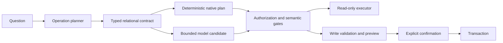

<div align="center">

# DBQuill — Open-Source AI Database Agent

**Natural Language to SQL · Safe Database Writes · Charts**

Ask your database in plain language. Review every operation before it runs.

An open-source, local-first Windows AI database agent for querying, understanding, visualizing, and safely updating SQLite, MySQL, and PostgreSQL.

[简体中文](README.zh-CN.md) · [Install](docs/INSTALLATION.md) · [Try the demo](docs/DEMO_TEST_GUIDE.md) · [Security](SECURITY.md)

[](https://github.com/jamesdffgy-source/DBQuill/actions/workflows/ci.yml)
[](https://github.com/jamesdffgy-source/DBQuill/releases)


[](LICENSE)

</div>


DBQuill turns a request into a typed, reviewable database operation before anything reaches the database. Read paths are physically read-only and bounded. Write paths stop at validation and a change preview until the user explicitly confirms them.

- **Ask naturally:** inspect schemas, search rows, calculate grouped metrics, compare periods, and continue with follow-up questions.
- **See useful results:** switch between tables and colorful charts without losing the underlying evidence.
- **Write deliberately:** choose a target table, fill a form based on its real columns and sample shape, preview the change, then confirm.
- **Keep control locally:** database credentials, model profiles, sessions, audit records, and uploads stay outside the source tree.

## See it in 60 seconds


1. Attach a SQLite database, import CSV/`.xlsx`, or add a read-only or controlled-write MySQL/PostgreSQL connection.
2. Ask a question such as `Which products grew fastest this quarter?`
3. Review the interpreted operation, relationship path, result table, and charts.
4. For an insert, choose the table, complete the generated form, review the preview, and confirm once.

## Quick start on Windows

Requirements:

- Windows 10 or 11, x64;
- CPython 3.12 (CI selects an available 3.12 patch release);
- Microsoft Edge WebView2 Runtime;
- Git for cloning and release verification.

```powershell
git clone https://github.com/jamesdffgy-source/DBQuill.git
cd DBQuill
.\scripts\install_and_start.cmd
```

The command creates an isolated `.venv`, installs the hash-locked dependency set, runs environment diagnostics, and opens the desktop app. Add any OpenAI-compatible text-model endpoint in Settings. The application does not require a specific model vendor.

To explore without using a real database:

```powershell
.\scripts\run_python.cmd scripts\create_demo_database.py
.\scripts\start_dbquill.cmd
```

Attach `demo_data/dbquill_demo.sqlite`, then follow the [demo guide](docs/DEMO_TEST_GUIDE.md). For manual setup, offline constraints, WebView2 help, and clean-machine verification, read the [installation guide](docs/INSTALLATION.md).

## What is verified

| Data source | Verified path | Current boundary |
| --- | --- | --- |
| SQLite | Schema, retrieval, metrics, charts, semantics, scheduling, and confirmed writes | Complete MVP path |
| CSV / `.xlsx` | Import into a local SQLite database | Legacy `.xls` is not supported |
| MySQL 8.4 | Schema, PK/FK discovery, bounded queries, grouped metrics, timeout and physical read-only enforcement | Controlled `INSERT`/`UPDATE`/`DELETE` is opt-in; live vendor write matrix is pending |
| PostgreSQL 17 | Schema, PK/FK discovery, bounded queries, grouped metrics, timeout and physical read-only enforcement | Controlled `INSERT`/`UPDATE`/`DELETE` is opt-in; live vendor write matrix is pending |

The source setup is continuously checked on a clean GitHub-hosted Windows environment. A release badge or source archive is not a claim of a signed native installer; the current distribution is source-first and requires Python 3.12.

## Why the architecture is different



The model is a planner input, not the authority. Deterministic schema operations and proven relational plans bypass model-generated SQL when possible. Every candidate still crosses the same authorization, single-statement, row-limit, semantic, and execution gates.

The desktop client talks only to a loopback `aiohttp` service protected by a local token and same-origin checks. SQLite reads use physical read-only connections plus `query_only`; remote reads use a separate read-only session even when controlled writes are enabled. Write confirmation is bound to one database, one reviewed plan, and one use.

## Verification

Run the same gate used in CI:

```powershell
.\scripts\check_project.cmd
```

Useful release checks:

```powershell
.\scripts\doctor.cmd
.\scripts\run_python.cmd scripts\smoke_startup.py
```

The project gate checks repository hygiene and credentials, compiles critical modules, runs the full security and functional regression suite, validates the fixed offline evaluation set, checks frontend JavaScript, and verifies the recorded source fingerprint.

Public benchmarks are diagnostic evidence, not templates for hard-coded SQL. The [benchmark report](docs/BENCHMARK_REPORT.md) separates model behavior, infrastructure failures, single-database execution, and multi-database Test Suite Accuracy.

## Security and privacy

- Queries are read-only by default, single-statement, and row-bounded.
- Writes require validation, a change preview, and explicit confirmation.
- Remote writes require an explicit controlled-write connection; only DML is enabled, while remote DDL remains blocked.
- Scheduled natural-language work cannot approve writes automatically.
- Audit records retain controlled metadata and hashes, not raw prompts, SQL, credentials, or result rows.
- Model credentials are stored in ignored local configuration and are never required in repository files.

Report sensitive issues privately as described in [SECURITY.md](SECURITY.md). Use [SUPPORT.md](SUPPORT.md) for ordinary setup questions and bug reports.

## Contributing

Issues, documentation corrections, reproducible database cases, and focused pull requests are welcome. Start with [CONTRIBUTING.md](CONTRIBUTING.md) and the [Code of Conduct](CODE_OF_CONDUCT.md). Product changes must preserve the read-only default, write-preview boundary, authorization scope, and project gate.

DBQuill is released under the [MIT License](LICENSE). Redistributed assets and their licenses are listed in [THIRD_PARTY_NOTICES.md](THIRD_PARTY_NOTICES.md). The hand-drawn project artwork is covered by the repository license; its provenance is recorded in [docs/assets/README.md](docs/assets/README.md).
