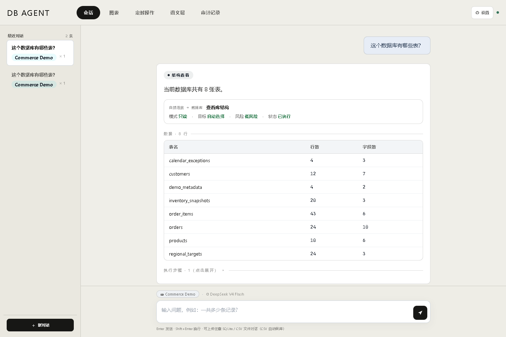
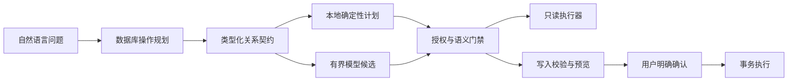

<div align="center">

# DB-Agent

**用自然语言询问数据库，每一步执行都先经过审查。**

一个面向 Windows 的本地优先数据库桌面工具，用于查询、理解、可视化和安全写入数据。

[English](README.md) · [安装说明](docs/INSTALLATION.zh-CN.md) · [体验演示](docs/DEMO_TEST_GUIDE.md) · [安全策略](SECURITY.md)

[](https://github.com/jamesdffgy-source/DB-Agent/actions/workflows/ci.yml)
[](https://github.com/jamesdffgy-source/DB-Agent/releases)


[](LICENSE)

</div>


DB-Agent 会先把请求转换成类型明确、可以审查的数据库操作，再接触数据库。查询链路使用物理只读连接并限制结果规模；写入链路必须停在校验和变更预览，直到用户明确确认。

- **自然提问：** 查看 Schema、检索数据、计算分组指标、比较周期，也能继续追问。
- **结果真正可用：** 在表格和彩色图表间切换，同时保留结果证据。
- **谨慎写入：** 选择目标表，根据真实字段和示例结构填写表单，预览变更，再确认一次。
- **控制留在本机：** 数据库凭据、模型配置、会话、审计记录和上传文件都不进入源码树。

## 60 秒了解使用流程



1. 接入 SQLite、导入 CSV/`.xlsx`，或添加只读 MySQL/PostgreSQL 连接。
2. 提问，例如“本季度增长最快的产品有哪些？”
3. 查看系统理解的操作、关系路径、结果表格和图表。
4. 需要新增数据时，选择目标表、填写生成的表单、检查预览并确认一次。

## Windows 快速开始

环境要求：

- Windows 10 或 Windows 11，x64；
- CPython 3.12（CI 选择可用的 3.12 补丁版本）；
- Microsoft Edge WebView2 Runtime；
- 用于克隆和校验版本的 Git。

```powershell
git clone https://github.com/jamesdffgy-source/DB-Agent.git
cd DB-Agent
.\scripts\install_and_start.cmd
```

该命令会创建隔离的 `.venv`、安装带哈希校验的依赖、执行环境诊断并打开桌面应用。在设置中添加任意兼容 OpenAI 接口格式的文本模型即可，程序不绑定特定模型厂商。

不接入真实数据库也可以体验：

```powershell
.\scripts\run_python.cmd scripts\create_demo_database.py
.\scripts\start_dbagent.cmd
```

随后接入 `demo_data/dbagent_demo.sqlite`，按照[演示指南](docs/DEMO_TEST_GUIDE.md)操作。手动安装、离线环境、WebView2 排障和干净机器验证见[安装说明](docs/INSTALLATION.zh-CN.md)。

## 已验证范围

| 数据源 | 已验证链路 | 当前边界 |
| --- | --- | --- |
| SQLite | Schema、检索、指标、图表、语义层、调度和确认写入 | 完整 MVP 主链 |
| CSV / `.xlsx` | 导入成本地 SQLite 数据库 | 不支持旧版 `.xls` |
| MySQL 8.4 | Schema、主外键、受限查询、分组指标、超时和只读执行 | 只读，尚不支持受控写入 |
| PostgreSQL 17 | Schema、主外键、受限查询、分组指标、超时和只读执行 | 只读，尚不支持受控写入 |

源码安装会持续在 GitHub 提供的全新 Windows 环境中验证。发布徽章或源码压缩包不代表已经提供签名的原生安装器；当前版本是源码优先发布，需要 Python 3.12。

## 架构为什么不同



模型只是规划输入，不是执行授权者。能够确定完成的 Schema 操作和关系计划优先走本地编译；所有候选仍必须经过同一套授权、单语句、行数、语义和执行门禁。

桌面端只访问 loopback 上的 `aiohttp` 服务，接口受本地 token 和同源检查保护。SQLite 查询使用物理只读连接与 `query_only`；写入确认只绑定一个数据库、一个已审查计划，并且只能使用一次。

## 验证

运行与 CI 相同的完整门禁：

```powershell
.\scripts\check_project.cmd
```

发布前常用检查：

```powershell
.\scripts\doctor.cmd
.\scripts\run_python.cmd scripts\smoke_startup.py
```

完成门禁会检查仓库卫生和凭据、编译关键模块、运行完整安全与功能回归、执行固定离线评测、检查前端 JavaScript，并核对已登记源码指纹。

公开 benchmark 只用于发现架构问题，不用于针对答案硬编码 SQL。[基准报告](docs/BENCHMARK_REPORT.md)会分别说明模型行为、基础设施失败、单库执行一致性和多库 Test Suite Accuracy。

## 安全与隐私

- 查询默认只读、只允许单语句并限制返回行数。
- 写入必须经过校验、变更预览和显式确认。
- 定时自然语言任务不能自动批准写操作。
- 审计只保留受控元数据和哈希，不保存原始问题、SQL、凭据或结果行。
- 模型凭据只写入被忽略的本机配置，源码文件不需要任何密钥。

敏感问题请按 [SECURITY.md](SECURITY.md) 私下报告；普通安装问题和缺陷报告见 [SUPPORT.md](SUPPORT.md)。

## 参与贡献

欢迎提交问题、文档修正、可复现数据库案例和范围清晰的 Pull Request。请先阅读 [CONTRIBUTING.md](CONTRIBUTING.md) 和[行为规范](CODE_OF_CONDUCT.md)。产品改动必须保持查询只读默认、写入预览确认、授权范围和项目门禁。

源码使用 [MIT License](LICENSE)。仓库内再分发资产及许可证见 [THIRD_PARTY_NOTICES.md](THIRD_PARTY_NOTICES.md)。项目手绘图使用仓库许可证，来源记录见 [docs/assets/README.md](docs/assets/README.md)。
